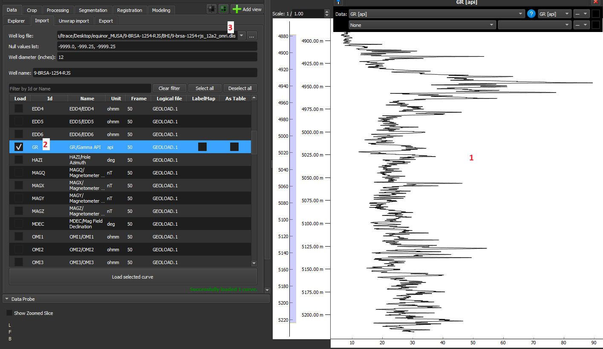
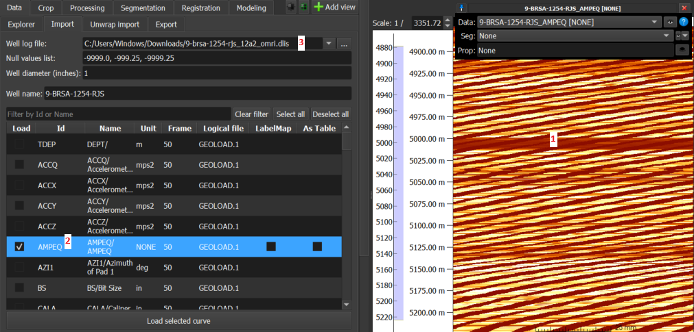
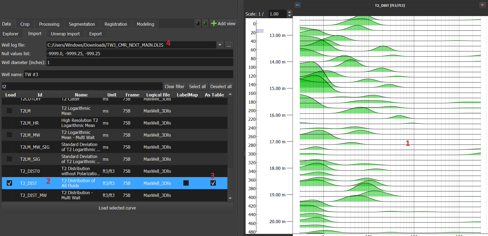

# Image Log Environment

Ambiente para trabalhar com Perfis de imagens de poços (ou *Image Logs*).

Módulos:

- **Data**: Explorer, Import, Export
- **Processing**: Eccentricity, Spiral Filter, Quality Indicator
- **Segmentation**: Manual, Instance, Instance Editor, Inspector
- **Registration**: Unwrap Registration
- **Modeling**: Permeability Modeling

## Explorer

Módulo _GeoSlicer_ para visualizar os dados sendo trabalhados e suas propriedades.

## Import

Módulo _GeoSlicer_ para carregar dados de perfis em DLIS, LAS e CSV, conforme descrito nos passos abaixo:

1. Selecione o arquivo de log de poço em _Well Log File_.

2. Edite _Null values list_ e adicione ou remova valores da lista de possíveis valores nulos.

3. Escolha os perfis desejados para serem carregados no GeoSlicer, de acordo com cada opção descrita abaixo:    
    
    \- Dados 1-D devem ser carregados sem selecionar as opções “As Table“ e “LabelMap” e são exibidos como gráficos de linha na Image Log View.

    |  |
    |:-----------------------------------------------:|
    | <pre>Figura 1: ImageLog Environment aberto. À direita, uma view (1) com dados que foram carregados da curva 'GR/Gamma API', selecionada à esquerda (2). Os dados foram importados de um arquivo DLIS (3).</pre> |

    \- Dados 2-D podem ser carregadas como volumes, tabelas ou LabelMap no GeoSlicer, sendo cada uma das opções detalhadas a seguir:

    - Volume: Esta é a opção padrão do GeoSlicer, sem marcar 'As Table' e 'LabelMap', sendo o dado carregado como volume e exibido como imagem na Image Log View;

    |  |
    |:-----------------------------------------------:|
    | <pre>Figura 2: À direita, uma view (1) com uma *borehole image* carregada da curva 'AMPEQ', selecionada à esquerda (2). Os dados foram importados de um arquivo DLIS (3).</pre>|

    - Tabelas: Nesta opção, marcando a checkbox 'As Table', o dado é carregado como tabela e é exibido como vários histogramas, como no caso do dado t2_dist da Figura 3 abaixo:

    |  |
    |:-----------------------------------------------:|
    | <pre>Figura 3: À direita, uma view com dados de NMR (1), que foram carregados da curva T2_DIST (2), selecionada à esquerda, marcada com a opção 'As Table' (3). Os dados foram importados de um arquivo DLIS (4).</pre> |

    - LabelMap: Nesta opção, marcando a checkbox 'LabelMap', assumindo um dado segmentado, ele é carregado como um LabelMap e exibido como imagem segmentada.

    |  |
    |:-----------------------------------------------:|
    | <pre>Figura 4: Dados segmentados (LabelMap) à direita (1), que foram carregados marcando a coluna com 'LabelMap' (2). Os dados foram carregados de um arquivo CSV (3).</pre> |

### Formatação dos arquivos a serem carregados
#### LAS
Curvas em sequência  com mnemônicos no formato `mnemonic[number]` serão agrupadas em dados 2-D. Por exemplo, os mnemônicos de uma imagem com 200 colunas:
<pre>
AMP[0]
…
AMP[199]
</pre>

Um mesmo arquivo pode conter dados 1-D e 2-D. No exemplo a seguir, AMP é uma imagem, enquanto LMF1 e LMF2 são dados 1-D:
<pre>
AMP[0]
…
AMP[199]
LMF1
LMF2
</pre>

#### CSV
Para o GeoSlicer interpretar dados CVS como 2-D, basta os mnemônicos serem de mesmo nome seguidos de um índice entre colchetes, como no 1º exemplo da seção LAS acima (AMP[0], …, AMP[199]).
Diferentemente do caso LAS, o arquivo deve ter somente os dados 2-D.

## Image Log Export

Módulo _GeoSlicer_ para exportar dados track, conforme descrito nos passos abaixo:

1. Selecione os dados a serem exportados.

2. Selecione o formato desejado e a pasta de saída.

## Eccentricity

O módulo Eccentricity é baseado na patente entitulada Method to correct eccentricity in ultrasonic image profiles, Pub. No.: US2017/0082767, pela aplicante Petrobras e os inventores Menezes, C., Compan, A. L. M. and Surmas, R.

É um método para corrigir a excentricidade de perfis de imagens ultrassônicas baseada nas medidas de tempo de trânsito. A correção é realizada ponto a ponto baseada no modelo de decaimento de amplitude exponencial e seu parâmetro "tau". Em geral, o valor tau que produz a melhor correção é obtido minimizando um dos momentos estatísticos desvio padrão, assimetria e curtose.

1. __Amplitude__: selecione um image log de _Amplitude_ a ser corrigido.
2. __Transit time__: selecione um image log de tempo de trânsito (_Transit time_) para ser usado na correção.
3. __Tau__: digite o valor do tau a ser usado na correção.
4. Aba __Tau Optimization__:
    - _No optimization_: A ferramenta apenas aplicará o tau de entrada ao processo de correção de imagem.
    - _Minimize STD_: A ferramenta encontrará o melhor valor tau que minimiza o desvio padrão da imagem corrigida.
    - _Minimize Skew_: A ferramenta encontrará o melhor tau que minimiza a assimetria absoluta da imagem corrigida.
    - _Minimize Kurtosis_: A ferramenta encontrará o melhor valor tau que minimiza a curtose da imagem corrigida.
5. Aba __Advanced Settings__:  
    - _Missing value_: O valor/rótulo nulo no dado será ignorado durante o processo de otimização.
    - _Minimum amplitude_: O valor de amplitude mínima da imagem de referência a ser considerado na otimização. Pixels/pontos abaixo da "amplitude mínima" serão ignorados na otimização.
    - _Maximum amplitude_: O valor de amplitude máxima da imagem de referência a ser considerado na otimização. Pixels/pontos acima da "amplitude máxima" serão ignorados na otimização.
    - _Minimum transit time_: O valor de tempo de trânsito mínimo da imagem de referência a ser considerado na otimização. Pixels/pontos abaixo do "tempo de trânsito mínimo" serão ignorados na otimização.
    - _Maximum transit time_: O valor de tempo de trânsito máximo da imagem de referência a ser considerado na otimização. Pixels/pontos acima do "tempo de trânsito máximo" serão ignorados na otimização.

## Spiral filter

Módulo _GeoSlicer_ para remover o efeito de espiralamento e excentricidade de dados image log.

O processo de filtragem é computado baseado em um filtro de rejeição de banda nas frequências de Fourier 2D da imagem. A banda comumente associadas a excentricidade e espiralamento é entre 4 e 100 metros de comprimentos de onda verticais e 360 graus de comprimento de onda horizontal.

Os comprimentos de onda mínimo e máximo exatos podem ser medidos a partir do dado pelo usuário usando a ferramenta __Ruler__.

1. Selecione a imagem de entrada em _Input image_.

2. Configure os parâmetros:
   - _Minimum wavelength_: Comprimento de onda vertical mínimo do efeito de espiralamento em metros.
   - _Maximum wavelength_: Comprimento de onda vertical máximo do efeito de espiralamento em metros.
   - _Filtering factor_: Fator multiplicativo do filtro. 0 resulta em filtragem nenhuma. 1 resulta em filtragem máxima.
   - _Band spectrum step length_: tamanho do passo/degrau da banda do espectro do filtro. Quanto maior o valor, mais suave o passo da largura da banda.

3. Defina o nome da imagem de saída em _Output image name_.

4. Clique em _Apply_.

## Quality Indicator

Módulo _GeoSlicer_ para indicar a qualidade de dados image log em termos de nível de excentricidade e efeitos de espiralamento.

A saída é uma imagem em que os valores próximos de 1 indicam um alto nível de excentricidade e espiralamento, enquanto em valores próximos de 0 indicam um baixo nível.

O indicador é computado baseado na transformada de Fourier 2D da imagem. Seus valores são definidos pelo espectro de amplitude média da banda comumente associada a excentricidade e espiralamento (comprimentos de onda verticais entre 4 e 100 metros e comprimentos de onda horizontais de 360 graus).

1. Selecione o volume de entrada em _Input volume_.

2. Configure os parâmetros:
   - _Window size_: Tamanho em metros da janela móvel usada para computer o indicador.
   - _Minimum wavelength_: Comprimento de onda vertical mínimo do efeito de espiralamento em metros.
   - _Maximum wavelength_: Comprimento de onda vertical máximo do efeito de espiralamento em metros.
   - _Filtering factor_: Fator multiplicativo do filtro. 0 resulta em filtragem nenhuma. 1 resulta em filtragem máxima.
   - _Band spectrum step length_: tamanho do passo da banda de espectro de filtro. Quanto maior o valor, mais suave o passo da largura da banda.

3. Defina o nome da imagem de saída em _Output image name_.

4. Clique em _Apply_.

## Manual segmentation

Módulo _GeoSlicer_ para segmentar imagens, conforme descrito nos passos abaixo:

1. Selecione a segmentação de saída em _Output segmentation_.

2. Selecione a imagem a ser segmentada em _Input image_.

3. Clique em _Add_ para adicionar segmentos.

4. Selecione um segmento da lista a ser editado.

5. Selecione uma ferramenta dentre as opção sob a lista de segmentos.

Mais instruções sobre cada ferramenta de segmentação pode ser encontrada após selecionada clicando em _Show details._

## Image Log Instance Segmenter

Módulo _GeoSlicer_ para aplicar segmentação de instância a image logs, conforme descrito nos passos abaixo. Para uma descrição mais detalhada dos métodos, consulte a seguinte [seção](../../Image Log/Instance Segmenter/instance_segmenter.md) do manual do GeoSlicer.

1. Selecione o modelo em _Model_, que determina o tipo do artefato a ser detectado.

2. Selecione as imagens necessárias:
    - Modelos sidewall sample: selecione a imagem de amplitude (_Amplitude image_) e a imagem de tempo de trânsito (_Transit time image_).
    - Modelos stops: selecione a imagem de tempo de trânsito em _Transit time image_.

3. Defina os parâmetros:
    - Modelos sidewall sample: selecione o arquivo de profundidades nominais em _Nominal depths file_ (opcional).
    - Modelos stops: defina os parâmetros limiar (_Threshold_), tamanho (_Size_) e _Sigma_.

4. Defina o prefixo de saída em _Output prefix_ (sugerido automaticamente ao serem selecionadas as imagens de entrada).

5. Clique no botão _Segment_ e aguarde a finalização.

## Instance Segmenter Editor

Módulo _GeoSlicer_ para visualizar e editar resultados do segmentador de instância.

### Visualizar

1. Defina o image log e o labelmap de segmentação (gerado pelo _Image Log Instance Segmenter_) nas views do _Image Log Environment_.

2. Selecione a tabela de report correspondete em _Report table_, também gerada pelo _Image Log Instance Segmenter_.

3. As instâncias detectadas podem ser inspecionadas clicando em qualquer uma das colunas da tabela _Parameters_. A instância selecionada será centrada nas views.

4. As instâncias detectadas também podem ser filtradas por algumas propriedades movendo os sliders na seção _Parameters_. Isso ajuda a escolher quais instâncias são boas candidatas.

### Editar

1. Abra a seção _Edit_ para adicionar, editar ou deletar instâncias.

2. Para editar, selecione uma instância databela e clique em _Edit_. Um cursor de mira aparecerá ao mover o mouse sobre as views. Clique para pintar uma instância no image log (pode-set também definir o tamanho do pincel em _Brush size_). Após terminar, clique em _Apply_.

3. Para deletar uma instância, simplesmente selecione na tabela, clique em _Decline_ e confirme.

4. Após terminar de editar, pode-se clicar em _Apply_, na parte inferior do módulo, para gerar outra tabela de relatório com as modificações com o prefixo escolhido em _Output prefix_. Clicar em _Cancel_ reverterá todas as modificações da tabela de relatório atual.

## Segment Inspector

Para uma discussão mais detalhada sobre o algoritmo watershed, por favor cheque a seguinte [seção](../../Inspector/Watershed/estudos_de_porosidade.md) do manual do GeoSlicer.

Este módulo provê múltiplos métodos para analisar uma imagem segmentada. Particularmente, algoritmos Watershed e Islands permite fragmentar a segmentação em diversas partições, ou diversos segmentos. Normalmente é aplicado a segmentação de espaço de poros para computar as métricas de cada elemento de poro. A entrada é um nodo de segmentação ou volume labelmap, uma região de interesse (definida por um nodo de segmentação) e a imagem/volume mestre. A saída é um labelmap onde cada partição (elemento de poro) está em uma cor diferente, uma tabela com parâmetros globais e uma tabela com as diferentes métricas para cada partição.

### Inputs

1. __Selecionar__ single-shot (segmentação única) ou Batch (múltiplas amostras definidas por múltiplos projetos GeoSlicer).
2. __Segmentation__: Selecionar um nodo de segmentação ou um labelmap para ser inspecionado.
3. __Region__: Selecionar um nodo de segmentação para definir uma região de interesse (opcional).
4. __Image__: Selecionar a imagem/volume mestre ao qual a segmentação é relacionada.

### Parameters

1. __Method__: Selecionar um método a ser aplicado. Com algoritmo island, a segmentação é fragmentada de acordo com conexões diretas. Com watershed, a segmentação é fragmentada de acordo com a transformada de distância e os parâmetros da seção _Advanced_.
2. __Size Filter__: Filtrar partições espúrias com eixo principal (feret_max) menor que o valor _Size Filter_.
3. __Smooth factor__: Fator de suavização, que é o desvio padrão do filtro gaussiano aplicado à transformada de distância. Conforme aumenta, menos partições serão criadas. Use valores menores para resultados mais confiáveis.
4. __Minimum distance__: Distância mínima separando picos em uma região de 2 * min_distance + 1 (i.e. picos são separados por no mínimo min_distance). Para encontrar o número máximo de picos, use min_distance = 0.
5. __Orientation line__: Selecionar a linha para ser usada para cálculo de ângulo de orientação.

### Output

Digite um nome para ser usado como prefixo dos resultados (labelmap onde cada partição (elemento de poro) está em uma cor diferente, uma tabela com parâmetros globais e uma tabela com as diferentes métricas para cada partição).

#### __Propriedades / Métricas__:

1. __Label__: Identificador rotular da partição.
2. __mean__: Valor médio da imagem/volume de entrada dentro da região da partição (poro/grão).
3. __median__: Valor mediano da imagem/volume de entrada dentro da região da partição (poro/grão).
4. __stddev__:	Desvio padrão da imagem/volume de entrada dentro da região da partição (poro/grão).
5. __voxelCount__: Número total de pixels/voxels da região da partição (poro/grão).
6. __area__: Área total da partição (poro/grão). Unidade: mm^2.
7. __angle__: Ângulo em graus (entre 270 e 90) relacionado à linha de orientação (opcional; se nenhuma linha for selecionada, a orientação de referência é superior horizontal).
8. __max_feret__: Eixo de caliper de Feret máximo. Unidade: mm.
9. __min_feret__: Eixo de caliper de Feret mínimo. Unidade: mm.
10. __mean_feret__: Média entre os calipers mínimo e máximo.
11. __aspect_ratio__: 	min_feret / max_feret.
12. __elongation__:	max_feret / min_feret.
13. __eccentricity__:	sqrt(1 - min_feret / max_feret)	relacionado à elipse equivalente (0 <= e < 1), igual a 0 para círculos.
14. __ellipse_perimeter__: Perímetro da elipse equivalente (com eixo dado por caliper de Feret mínimo e máximo). Unidade: mm.
15. __ellipse_area__: Área da elipse equivalente (com eixo dado por caliper de Feret mínimo e máximo). Unidade: mm^2.
16. __ellipse_perimeter_over_ellipse_area__: Perímetro da elipse equivalente dividido pela área.
17. __perimeter__: Perímetro real da partição (poro/grão). Unidade: mm.
18. __perimeter_over_area__: Perímetro real dividido pela área da partição (poro/grão).
19. __gamma__: "Redondeza" de uma área calculada como 'gamma = perimeter / (2 * sqrt(PI * area))'.
20. __pore_size_class__: Símbolo/código/id da classe do poro.
21. __pore_size_class_label__: Rótulo da classe do poro.

#### __Definição das classes de poro__:

* __Microporo__: classe 0, max_feret menor que 0.062 mm.
* __Mesoporo mto pequeno__: classe 1, max_feret entre 0.062 e 0.125 mm.
* __Mesoporo pequeno__: classe 2, max_feret entre 0.125 e 0.25 mm.
* __Mesoporo médio__: classe 3, max_feret entre 0.25 e 0.5 mm.
* __Mesoporo grande__: classe 4, max_feret entre 0.5 e 1 mm.
* __Mesoporo muito grande__: classe 5, max_feret entre 1 e 4 mm.
* __Megaporo pequeno__: classe 6, max_feret entre 4 e 32 mm.
* __Megaporo grande__: classe 7, max_feret maior que 32mm.

## Unwrap Registration

Módulo _GeoSlicer_ para registrar manual unwraps de core em image logs, conforme descrito nos passos abaixo:

1. Selecione a imagem de entrada em _Input unwrap image_.

2. Mude os valores de profundidade (_Depth_) e orientação (_Orientation_) conforme desejado.

3. Clique em _Apply_.

4. Para aplicar permanentemente os resultados, clique em _Save_. _Reset_ reverterá a imagem ao último estado salvo.

## Permeability Modeling

O módulo de modelagem é baseado na referência Menezes de Jesus, C., Compan, A. L. M. and Surmas, R., Permeability Estimation Using Ultrasonic Borehole Image Logs in Dual-Porosity Carbonate Reservoirs, 2016.

É um método para modelagem de permeabilidade usando um image log segmentado e um log de porosidade. A porosidade total é pesada por frações de cada uma das classes segmentadas de entrada extraídas dos image logs. 

A permeabilidade é definida por

K = (A1 * F1* Phi ^B1) + (A2 * F2* Phi ^B2) + ... +  (An * Fn* Phi ^Bn)  +  (Am * Fm* Phi),

onde A e B são os parâmetros da equação, F são as frações das n classes de segmento e m é o segmento de macroporo.

1. Depth Log: Selecione o log de profundidade  do arquivo LAS relacionado ao log de porosidade.
2. Porosity Log: Selecione o log de porosidade importado do arquivo LAS.
3. Depth Image: Selecione a profundidade relacionada ao image log segmentado.
4. Segmented Image: Selecione o image log segmentado.
5. Macro Pore Segment class: Selecione a classe de segmento relacionada ao segmento de macroporo.
6. Ignore class: Selecione a classe de segmento relacionada à classe nula.
7. Plugs Depth Log: Selecione a profundidade das medidas do plugue.
8. Plugs Permeability Log: Selecione as medidas de permeabilidade dos plugues.
