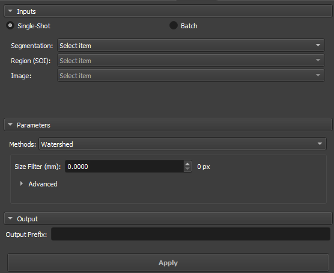
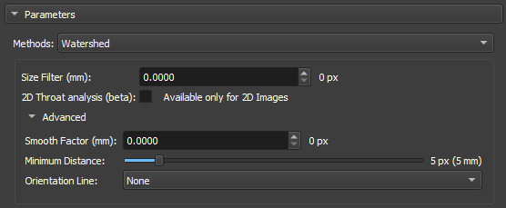

# Segment Inspector

Este módulo fornece vários métodos para analisar uma imagem segmentada. Particularmente, os algoritmos Watershed e Separate objects permitem fragmentar uma segmentação em várias partições, ou vários segmentos. Geralmente é aplicado à segmentação do espaço poroso para calcular as métricas de cada elemento poroso.
A entrada é um nó de segmentação ou volume de labelmap, uma região de interesse (definida por um nó de segmentação) e a imagem/volume mestre. A saída é um labelmap onde cada partição (elemento poro) está em uma cor diferente, uma tabela com parâmetros globais e uma tabela com as diferentes métricas para cada partição.

## Painéis e sua utilização

|  |
|:-----------------------------------------------:|
| Figura 1: Apresentação do módulo Segment Inspector. |

### Principais opções:
A interface do módulo Segment Inspector é composta por Inputs, Parameters e Output

#### Single input

|  |
|:-----------------------------------------------:|
| Figura 2: Apresentação dos inputs no módulo Segment Inspector. |

 - _Segmentation_: Input para a segmentação utilizada na partição.

 - _Region SOI_: Escolha Uma segmentação de interresse que contenha ao menos uma parte da segmentação utilizada em _Segmentation_.

 - _Image_: Campo preenchido automaticamente com o nodo de referência da segmentação utilizada em _Segmentation_.

#### Attributes

|  |
|:-----------------------------------------------:|
| Figura 3: Atributos de segmentos no módulo Segment Inspector. |

 - _Segments_: Segmentos contidos na segmentação selecionada em _Segmentation_. A lista informa sobre a visualização do segmento pelo icone do olho. Para a inicialização do metodo de fragmentação um segmento deve ser selecionado.

 - _Calculate proportions_: Checkbox para apresentar as proporções de cada segmento na imagem.

 - _Dimension(px)_: Apresenta as dimensões da imagem selecionada.

### Parâmetros e Métodos

#### Watershed

O algoritmo de Watershed funciona simulando a expansão de "bacias hidrográficas" a partir de pontos marcados como mínimos locais. À medida que a "água" preenche os vales, ela define as fronteiras entre diferentes regiões. Essa abordagem é amplamente utilizada em aplicações onde é necessário separar objetos ou poros em materiais, aproveitando os contrastes entre regiões.

|  |
|:-----------------------------------------------:|
| Figura 4: Watershed no módulo Segment Inspector. |

 - _Size Filter(mm)_: Controla o alcance máximo de segmentação, influenciando diretamente o tamanho e a conectividade das regiões segmentadas. Valores pequenos são Usados quando você deseja segmentar muitos detalhes finos em contrapartida Valores grandes são usados quando o foco é em grandes áreas ou objetos conectados.

 - _2D throat analysis(beta)_: Adiciona métricas de analise de gargantas 2d no report.

 - _Smooth factor_: Parâmetro que ajusta o grau de suavidade nas bordas das regiões segmentadas, permitindo controle entre a preservação dos detalhes e a redução de ruído ou irregularidades. Com Fatores altos a segmentação será mais suave e simplificada, mas com perda de pequenos detalhes.

 - _Minimun Distance_: parâmetro que determina a menor distância permitida entre dois máximos locais ou objetos segmentados. Um valor maior deste parâmetro fundirá objetos próximos, simplificando a segmentação, enquanto um valor menor permitirá a separação de objetos mais próximos, resultando em uma segmentação mais detalhada.

 - _Orientation Line_: O parâmetro de orientação permite que o algoritmo alinhe-se adequadamente com as características da imagem, melhorando a precisão da segmentação

#### Separate Objects

 O método de segmentação por "Separate Objects
" identifica regiões conectadas em uma matriz binária que representam objetos de informação. Este processo é especialmente útil em análise de porosidade, onde é importante distinguir diferentes regiões conectadas dentro de um volume.

|  |
|:-----------------------------------------------:|
| Figura 5: Separate Objects no módulo Segment Inspector. |

 - _Size Filter(mm)_: Controla o alcance máximo de segmentação, influenciando diretamente o tamanho e a conectividade das regiões segmentadas. Valores pequenos são Usados quando você deseja segmentar muitos detalhes finos em contrapartida Valores grandes são usados quando o foco é em grandes áreas ou objetos conectados.

 - _Orientation Line_: O parâmetro de orientação permite que o algoritmo alinhe-se adequadamente com as características da imagem, melhorando a precisão da segmentação

#### GPU Watershed

A técnica de Deep Watershed combina o conceito tradicional de Watershed com redes neurais profundas para obter uma segmentação mais precisa e robusta. Utilizando a força de aprendizado profundo, o método aprimora a detecção de limites e objetos em cenários complexos, como a análise de materiais porosos com múltiplos níveis de sobreposição. Essa abordagem é particularmente eficaz para lidar com volumes tridimensionais e para realizar segmentações precisas em imagens ruidosas.

|  |
|:-----------------------------------------------:|
| Figura 6: GPU Watershed no módulo Segment Inspector. |

 - _Split Threshold(0-1)_: Controla o alcance máximo de segmentação, influenciando diretamente o tamanho e a conectividade das regiões segmentadas. Valores pequenos são usados quando você deseja segmentar muitos detalhes finos em contrapartida valores grandes são usados quando o foco é em grandes áreas ou objetos conectados.

 - _2D throat analysis(beta)_: Adiciona métricas de analise de gargantas 2d no report.

 - _Base volume (px)_: Esse parâmetro representa um valor base que pode ser relacionado ao tamanho ou à escala do volume que está sendo processado. Ele serve como uma referência para calcular a profundidade ou as camadas do volume que serão analisadas.

 - _Intersection (px)_:Esse parâmetro é usado para ajustar o quanto as regiões dentro do volume podem se sobrepor umas às outras durante a segmentação. 

 - _Border (px)_: Esse parâmetro define o tamanho ou a espessura das bordas que serão consideradas ao calcular as camadas de profundidade no volume.

 - _Background Threshold(0-1)_:  Atua como um ponto de corte. Todos os valores abaixo desse limiar (threshold) são considerados como pertencentes ao fundo (ou background), enquanto valores acima do limiar são considerados como partes de objetos ou regiões significativas dentro da imagem ou volume.

#### Transitions Analysis

A Análise de Transições se concentra em examinar as mudanças entre regiões ou segmentos de uma imagem. Este método é empregado principalmente para estudar a mineralogia de amostras.

|  |
|:-----------------------------------------------:|
| Figura 7: Transitions Analysis no módulo Segment Inspector. |

 - _Include Background_: Usa as dimensões totais da imagem de entrada para análise.

#### Basic Petrophysics

|  |
|:-----------------------------------------------:|
| Figura 8: Transitions Analysis no módulo Segment Inspector. |

 - _Include Background_: Usa as dimensões totais da imagem de entrada para análise.

### Output

Digite um nome para ser usado como prefixo para o objeto de resultados (mapa de rótulos onde cada partição (elemento de poro) está em uma cor diferente, uma tabela com parâmetros globais e uma tabela com as diferentes métricas para cada partição).

### Propriedades / Métricas:

1. __Label__: identificação do rótulo da partição.
2. __mean__: valor médio da imagem/volume de entrada dentro da região da partição (poro/grão).
3. __median__: valor mediano da imagem/volume de entrada dentro da região da partição (poro/grão).
4. __stddev__:	Desvio padrão do valor da imagem/volume de entrada dentro da região da partição (poro/grão).
5. __voxelCount__: Número total de pixels/vóxels da região da partição (poro/grão).
6. __area__: Área total da partição (poro/grão). Unidade: mm².
7. __angle__: Ângulo em graus (entre 270 e 90) relacionado à linha de orientação (opcional, se nenhuma linha for selecionada, a orientação de referência é a horizontal superior).
8. __max_feret__: Maior eixo de Feret. Unidade: mm.
9. __min_feret__: Menor eixo de Feret. Unidade: mm.
10. __mean_feret__: Média dos eixos mínimo e máximo.
11. __aspect_ratio__: 	min_feret / max_feret.
12. __elongation__:	max_feret / min_feret.
13. __eccentricity__:	quadrado(1 - min_feret / max_feret), relacionado à elipse equivalente (0 ≤ e < 1), igual a 0 para círculos.
14. __ellipse_perimeter__: Perímetro da elipse equivalente (elipse equivalente com eixos dados pelos eixos mínimo e máximo de Feret). Unidade: mm.
15. __ellipse_area__: Área da elipse equivalente (elipse equivalente com eixos dados pelos eixos mínimo e máximo de Feret). Unidade: mm².
16. __ellipse_perimeter_over_ellipse_area__: Perímetro da elipse equivalente dividido por sua área.
17. __perimeter__: Perímetro real da partição (poro/grão). Unidade: mm.
18. __perimeter_over_area__: Perímetro real dividido pela área da partição (poro/grão).
19. __gamma__: Arredondamento de uma área calculado como 'gamma = perímetro / (2 * quadrado(PI * área))'.
20. __pore_size_class__:  Símbolo/código/id da classe do poro.
21. __pore_size_class_label__: Rótulo da classe do poro.

#### Definição das classes de poros:

* __Microporo__:  classe = 0, max_feret menor que 0,062 mm.
* __Mesoporo muito pequeno__: classe = 1, max_feret entre 0,062 e 0,125 mm.
* __Mesoporo pequeno__: classe = 2, max_feret entre 0,125 e 0,25 mm.
* __Mesoporo médio__: classe = 3, max_feret entre 0,25 e 0,5 mm.
* __Mesoporo grande__: classe = 4, max_feret entre 0,5 e 1 mm.
* __Mesoporo muito grande__: classe = 5, max_feret entre 1 e 4 mm.
* __Megaporo pequeno__: classe = 6, max_feret entre 4 e 32 mm.
* __Megaporo grande__: classe = 7, max_feret maior que 32 mm.

