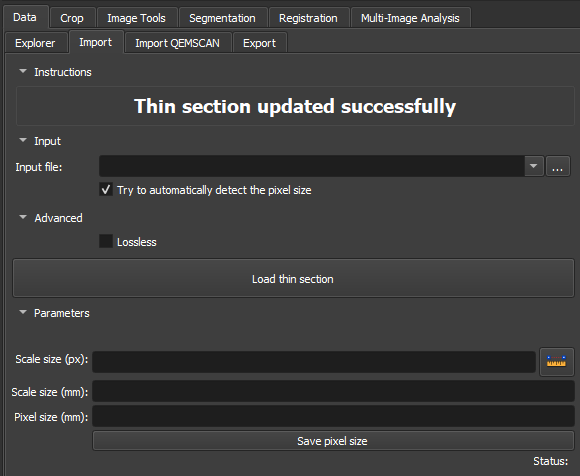

# Thin Section Loader

O módulo ThinSectionLoader foi projetado para carregar e processar com eficiência imagens de seção fina no ambiente _Thin section_. Ele importa imagens PNG, JPG/JPEG, BMP, GIF, e TIFF. Ele integra detecção automatizada de escala usando Tesseract OCR, garantindo uma estimativa precisa do tamanho do pixel. O módulo também inclui opções avançadas para manipulação de imagens sem perdas e permite ajustes manuais nos parâmetros de espaçamento das imagens, tornando-o adaptável a diversas necessidades de análise geológica.

## Painéis e sua utilização

|  |
|:-----------------------------------------------:|
| Figura 1: Apresentação do módulo Thin Section Loader. |

### Principais opções:

 - _Input file_: Escolha o caminho da Imagem a ser importada. As extenções mais usadas são:PNG, JPG/JPEG, BMP, GIF, e TIFF.

 - _Advanced Lossless_: Utilizar uma opção de compressão lossless garante que a qualidade original da imagem seja preservada integralmente, sem perda de dados durante o processo.

 - _Scale size(px)_: Seção para definir a faixa de pixels usada na proporção de pixels por milímetro. O ícone de régua à direita permite adicionar uma marcação na escala da imagem, facilitando essa definição.

 - _Scale size(mm)_: Seção para definir o tamanho em milímetros da faixa de pixels selecionada. Se a régua foi utilizada na escala da imagem, o valor deverá ser correspondente.

 - _Pixel size(mm)_: Proporção entre pixels/mm pode ser definida ou resultante da medida dos campos _Scale size(px)_ e _Scale size(mm)_

 - _Save pixel size_: Definida a proporção entre pixels/mm o botão atrela o valor à imagem.
