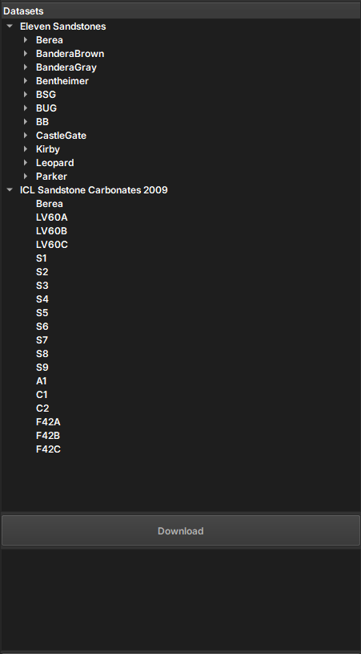

# Open Data Rocks

O módulo Open Data Rocks permite o acesso à imagens digitais de rochas normalmente adquiridas usando técnicas de imagem tridimensionais. O módulo utiliza a biblioteca **[drd](https://github.com/LukasMosser/digital_rocks_data)**
 de Lukas-Mosser para acessar dados de microtomografia de diferentes fontes geológicas, incluindo o **[Digital Rocks Portal](https://www.digitalrocksportal.org/)**
 e **[Imperial College London](https://www.imperial.ac.uk/earth-science/research/research-groups/pore-scale-modelling/micro-ct-images-and-networks/)**
. Ele permite o download e a extração de datasets importantes, como Eleven Sandstones e ICL Sandstone Carbonates, facilitando o processamento e salvamento em formato NetCDF para análise posterior.

## Painéis e sua utilização

|  |
|:-----------------------------------------------:|
| Figura 1: Apresentação do módulo Auto Registration. |

### Principais opções:
 
 - _Datasets_: Escolha entre as imagens disponíveis para download

 - _Download_: inicie o donwload da amostra selecionada

 - _Painel de retorno_: Informações sobre o processo de download são retornadas através desse painel

